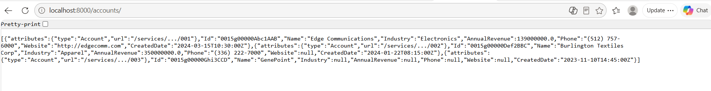
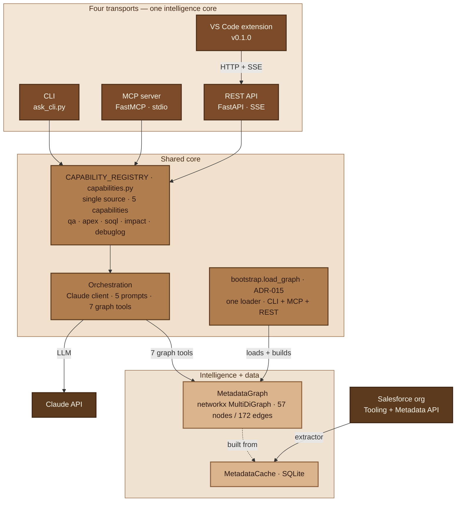
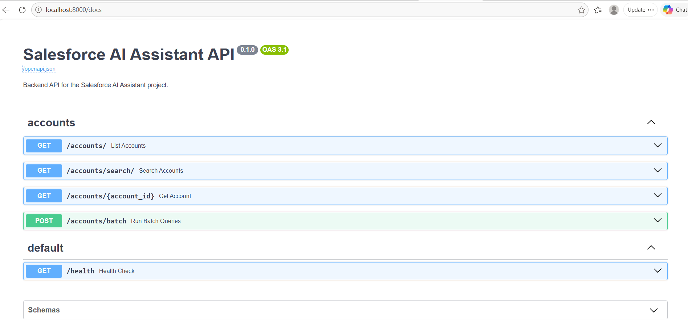
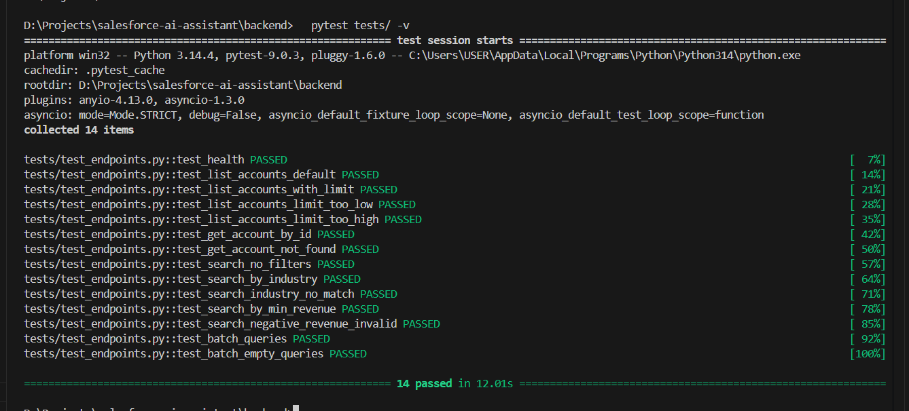

# Salesforce Graph

**The AI metadata graph for Salesforce developers.** Map your org's dependencies
— Apex, Flows, objects, triggers — into a queryable graph, then ask it questions
in natural language. Find out what breaks *before* you ship.

[](LICENSE)


<!-- HERO GIF: capture the webview deployment-impact run on demo day (Day 4-5), then embed here -->

---

## "What breaks if I delete this field?"

A Salesforce org is a dependency tangle. A field feeds a Flow, which calls an
Apex class, which is referenced by a trigger, which is covered by a test class.
The connections are real but invisible — so change sets break things that look
unrelated, and "is this safe to delete?" is a question nobody can answer with
confidence.

**Salesforce Graph extracts that web into an explicit dependency graph and puts
an LLM in front of it.** Ask in plain English; get answers grounded in the actual
graph, with the dependency path traced — not a guess from a model that never saw
your org.

```
> What is the deployment impact of changing the Opportunity object?

Changing Opportunity affects 6 components across 2 hops:
  OpportunityTrigger → TriggerDispatcher → OpportunityDomain → PricingService
  ...and the Flow Opportunity_Sales_Orchestration_Flow (via an Apex action).
```

---

## Capabilities

Five capabilities, each grounded in the metadata graph rather than the model's
priors:

| Capability | Ask it | Example |
|---|---|---|
| **Metadata Q&A** | structure & dependency questions | *"What references `PricingService`?"* |
| **Apex explanation** | explain a class/trigger with its real dependencies | *"Explain this trigger and what it touches."* |
| **SOQL generation** | natural language → SOQL using your org's actual fields | *"Opportunities created last quarter for accounts with no contacts."* |
| **Deployment impact** | blast-radius of a change before you deploy | *"What breaks if I change the Opportunity object?"* |
| **Debug-log analysis** | root-cause a log against the graph + source | *"Why did this transaction fail?"* |

<!-- TODO: confirm this shows a capability response; rename caption if not -->

*A capability response, streamed from the REST API.*

---

## Four transports, one core

The same intelligence core is reachable four ways — a CLI, an MCP server (for
Claude Desktop / Claude Code / Augment AI), a REST API, and a VS Code extension.
The extension rides the REST spine; the other three share one graph loader and
one capability registry, so a capability behaves identically everywhere.



<!-- TODO: confirm this shows the REST API docs; rename caption if not -->

*The REST API — five capability routes plus the read-only graph endpoint.*

---

## Architecture

The graph is the moat. A Salesforce org is extracted into a local **SQLite
cache** (Apex classes, triggers, and Flows, via the Tooling and Metadata APIs),
then built into a **networkx `MultiDiGraph`** — `MultiDiGraph` because two
components can relate more than one way at once (a `REFERENCES` edge *and* a
`CALLS` edge between the same pair), and a plain digraph would silently drop one.

Above the graph sits a thin intelligence layer: a `CAPABILITY_REGISTRY`
(the single source of truth for what each capability is and which graph tools it
may call) and an orchestration loop that hands Claude **seven graph tools**
(`find_dependencies`, `analyze_impact`, `get_source`, …) and lets it traverse the
graph to answer. Every transport loads the graph through one shared,
working-directory-independent loader (`bootstrap.load_graph`), so the CLI, MCP
server, and REST API can't drift apart.

The design decisions behind this — why a graph, why `MultiDiGraph`, why a
hand-rolled REST client, why the renderer seam — are documented as **19
Architecture Decision Records**. For the full picture see
[`docs/architecture.md`](docs/architecture.md); the decision trail with
supersessions annotated is in [`docs/decisions/`](docs/decisions/).

---

## Quickstart

### Prerequisites

- Python 3.11+
- A Salesforce Developer Edition org (free at [developer.salesforce.com](https://developer.salesforce.com))
- An Anthropic API key (for the capability layer)

### 1. Install

```bash
git clone https://github.com/vedaarvindkaja/salesforce-ai-assistant.git
cd salesforce-ai-assistant/backend
pip install -r requirements.txt
```

### 2. Connect your org (one-time)

In your dev org: **Setup → App Manager → New External Client App**. Enable OAuth,
set the callback URL to `http://localhost:8000/auth/callback`, select scopes
`api`, `refresh_token`, `id`, and enable PKCE + Refresh Token Rotation. Save, wait
~10 minutes for propagation, then copy the Consumer Key and Secret.

Copy the env template and fill in those values:

```bash
cp .env.example .env
# Set SALESFORCE_CLIENT_ID / _SECRET and ANTHROPIC_API_KEY
# Set USE_MOCK_DATA=false to use the real org
```

Authenticate by visiting `http://localhost:8000/auth/login` once (run the server
first — step 4).

### 3. Build the graph

Extract your org's Apex, triggers, and Flows into the local cache:

```bash
python -m scripts.extract_to_cache
```

This is what the graph is built from — the capabilities return 503 until it
exists.

### 4. Ask it something

**CLI:**

```bash
python ask_cli.py --mode impact "What breaks if I change the Opportunity object?"
```

**REST API** (also what the VS Code extension talks to):

```bash
uvicorn app.main:app --reload
# POST http://localhost:8000/api/v1/deployment-impact  (streams Server-Sent Events)
```

**MCP server** (Claude Desktop / Claude Code / Augment AI) — see
[`docs/mcp-server.md`](docs/mcp-server.md) for per-client config.

**VS Code extension** — install `vscode-extension/salesforce-graph-0.1.0.vsix`
(Extensions panel → ⋯ → *Install from VSIX…*), point `salesforceGraph.apiBaseUrl`
at your running API, and use the palette or right-click an `.cls`/`.log` file.
See [`vscode-extension/README.md`](vscode-extension/README.md).

---

## Open source

Everything in Phase 1 is open source under the [MIT License](LICENSE) — the
metadata extractor, the graph, the intelligence core, and all four transports.

This is structured as an open core: advanced or enterprise capabilities may be
offered under separate terms in a later phase. Today there is no paywalled tier —
Phase 1 *is* the open core.

---

## Project status

**Phase 1 — portfolio-ready, single-user.** This is a working, end-to-end
platform, not a hardened multi-tenant product, and it states its maturity plainly:

- **Single-user / local.** No API-key auth or rate limiting yet (parked; trigger:
  serves more than one user).
- The graph rebuilds on load (parked; trigger: rebuild exceeds ~2s).
- Field-grain nodes and Flow record-operation edges are deferred (parked; trigger:
  an eval fails for field-grain reasons).

<!-- TODO: confirm this shows the test run; rename caption if not -->

*344 unit tests + 25 semantic evals, green.*

**By the numbers:** 57-node / 172-edge graph · 5 capabilities · 4 transports ·
344 unit tests + 25 semantic evals · 19 ADRs.

---

## License

[MIT](LICENSE)
