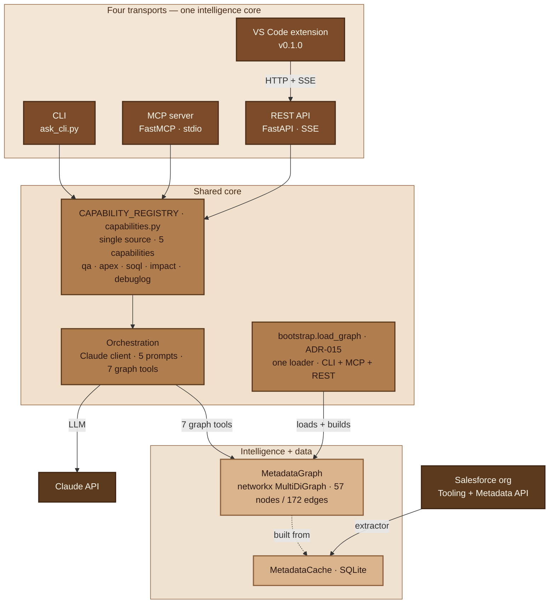
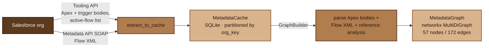

# Architecture

Salesforce Graph turns a Salesforce org into an explicit **dependency graph** and
puts an LLM orchestration layer on top of it. The graph is the moat: every answer
is grounded in the org's actual structure — traced through real nodes and edges —
rather than guessed by a model that never saw the org. The same core is reachable
through four transports.

---

## Layered architecture (ADR-001)

Three layers, each depending only **downward**:

- **`salesforce/`** — OAuth and the Salesforce API clients (REST, Tooling,
  Metadata SOAP) plus the token store. Knows Salesforce; knows nothing about
  graphs or Claude.
- **`intelligence/`** — the graph (build, storage, query), the Apex/Flow parsers,
  and the orchestration that drives Claude. The product's brain. Depends on
  `salesforce/` for raw metadata; knows nothing about transports.
- **`interfaces/`** — the consumer surfaces (CLI, MCP server, REST API). Thin:
  each loads the graph and delegates to the intelligence layer. The VS Code
  extension sits outside the backend and talks to the REST interface.

---

## The metadata graph (the moat)

An org becomes a graph in three stages — extract, build, query:

1. **Extract** (`scripts/extract_to_cache.py`) — the Tooling API pulls Apex class
   and trigger bodies plus the active-flow list; the Metadata API (SOAP
   `readMetadata`) pulls each active flow's XML. Everything is cached in SQLite,
   partitioned by the org's `instance_url` (ADR-005). Flow XML is cached raw and
   parsed at build time, the same discipline as Apex bodies.
2. **Build** (`GraphBuilder`) — reads the cache, parses Apex bodies with a
   pattern parser (extracting SOQL/DML/field/class references), parses Flow XML,
   and runs reference analysis, emitting typed nodes and edges.
3. **Query** (`MetadataGraph`) — wraps networkx (ADR-008) as a **`MultiDiGraph`**
   (ADR-011). Node types: `ApexClass`, `ApexTrigger`, `Object`, `Flow`. Edge
   types: `REFERENCES`, `CALLS`, `USES_OBJECT`, and Flow→Apex edges (only for
   `actionCalls` whose `actionType` is `apex`).

**Why `MultiDiGraph`.** Two components can relate more than one way at once — a
class can both `REFERENCE` and `CALL` another. A plain `DiGraph` collapses
parallel edges and silently drops one; the `MultiDiGraph` keeps every typed
relationship. This is the ADR-008 → ADR-011 supersession: the original digraph
choice proved lossy under parallel typed edges and was replaced.

---

## The intelligence layer

- **`CAPABILITY_REGISTRY`** (`capabilities.py`) — the single source of truth for
  the five capabilities. Each entry declares its system-prompt framing and which
  graph tools it may call (e.g. `impact` is restricted to a graph-only subset).
  `build_capability_client(mode, …)` assembles a mode-configured client from this
  registry, so **every transport builds capabilities the same way** and they
  can't diverge.
- **Orchestration** (`claude_client`) — an agentic loop. Claude is handed the
  graph tools and traverses the graph *itself*: calling `find_dependencies`,
  `analyze_impact`, `get_source`, reading results, and continuing until it can
  answer. The loop tracks token cost and caps iterations. Two consumers of the
  same loop: `ask()` **streams** chunks (used by REST), `ask_collected()` joins
  them into one string (used by MCP).
- **The 7 graph tools** (`tool_definitions`) — `find_dependencies`,
  `find_references_to`, `analyze_impact`, `find_by_name`, `graph_health`,
  `analyze_debug_log`, `get_source`. (`get_source` is built only when a metadata
  cache is available.)
- **Debug-log** (ADR-017) — the one capability that does *not* hand Claude a raw
  artifact. `parser.py` tokenizes the Salesforce log; `correlate.py`
  cross-references the parsed events against the graph; Claude receives structured
  prose, never the raw log.

---

## The shared graph loader (ADR-015)

`bootstrap.load_graph` is one pure, timing-agnostic, working-directory-independent
loader: it reads the stored OAuth tokens (→ `org_key`), opens the cache, builds
the graph, and returns a bundle `(engine, graph, cache, org_key)`. The CLI, MCP
server, and REST API all load through it, so there is exactly **one**
graph-loading code path.

Each transport owns its lifecycle at the edge — the CLI loads on run; the REST
API loads eagerly-but-tolerantly in its lifespan (a failed load doesn't crash the
app, it makes capability routes return `503`); the MCP server lazy-loads on first
tool call — but the loading *itself* is shared.

Working-directory independence matters because MCP hosts launch the server from a
directory you don't control (Claude Desktop was observed launching it from
`C:\Windows\System32`). The loader resolves the cache via `SF_CACHE_PATH` or a
path relative to its own source file — never the cwd.

---

## Transports

| Transport | Consumer of the loop | Notes |
|---|---|---|
| **CLI** (`ask_cli.py`) | direct | `--mode` selects the capability; loads via `bootstrap`. |
| **MCP server** (FastMCP, stdio) | collected (`ask_collected`) | MCP tool results are single strings; cost logged to **stderr** (the host rewrites tool results). See [`mcp-server.md`](mcp-server.md). |
| **REST API** (FastAPI) | streaming (`ask` → SSE) | 5 routes + `/graph`; `503` readiness gating. See [`rest-api.md`](rest-api.md). |
| **VS Code extension** | (via REST) | A REST client — rides the spine, doesn't re-implement the core. See [`../vscode-extension/README.md`](../vscode-extension/README.md). |

The **streaming-vs-collected** split is the only place the transports differ:
REST emits `chunk` events as Claude produces them; MCP collects the full answer
because the protocol expects a single tool result. Both consume the *same*
orchestration loop.

---

## Design decisions

The trade-offs behind all of the above are recorded as **19 Architecture Decision
Records** — why a graph, why `MultiDiGraph` (008→011), why the shared loader
(015), why explicit typed REST routes (016), why server-side log parsing (017),
why the extension's renderer seam (018) and hand-rolled client (019). The full
trail, with supersessions and refinements annotated, is in
[`docs/decisions/`](decisions/).
